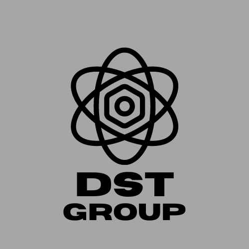
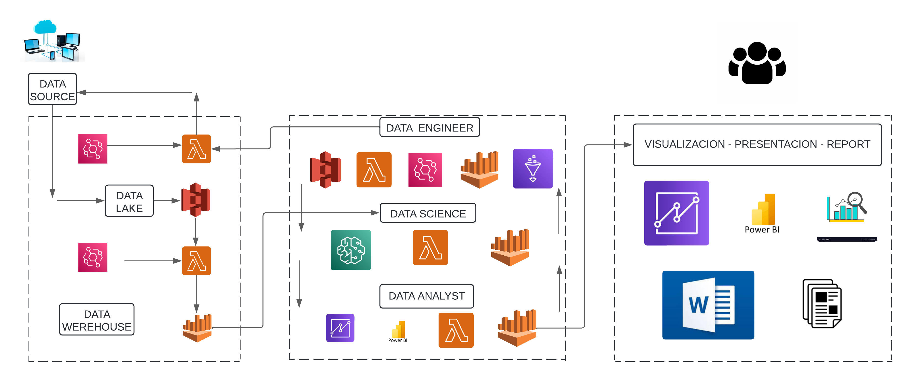

# Taxis NYC y Emisión de Carbono

## Índice
- [Introducción](#introducción)
- [¿Quienes Somos?](#quienes-somos)
- [Objetivos](#objetivo-principal)
- [Alcance](#alcance)
- [Metodologia](#metodología)
- [KPI´s](#kpis)
- [Tegnologias](#tecnologías)
- [Fuentes de Datos Y Recursos](#fuentes-de-datos-y-recursos)
- [Colaboradores](#colaboradores)

## Introducción
Los servicios de taxis y transporte compartido representan una alternativa moderna a los medios de transporte público tradicionales. Estos vehículos generan una gran cantidad de datos que pueden utilizarse para mejorar la eficiencia del servicio y abordar problemas globales, como el cambio climático. El aumento de la temperatura del planeta y la contaminación del aire debido a los gases residuales de los vehículos que utilizan combustibles fósiles pueden tener efectos letales en el futuro cercano. 

Una compañía interesada en invertir en el transporte de pasajeros en automóviles en la ciudad de Nueva York debe evaluar la relación entre este medio de transporte y la contaminación atmosférica y auditiva, considerando la viabilidad de implementar vehículos eléctricos en su flota mediante un análisis preliminar del movimiento de los taxis y otros datos relevantes, como la calidad del aire y las correlaciones climáticas.

## ¿Quienes Somos?

### Bienvenido a DST Group

</img>

En DST Group, estamos dedicados a ofrecer soluciones innovadoras en el mundo de la tecnología de la información. Especializados en ciencia de datos, ingeniería de datos y análisis de datos, nuestro equipo multidisciplinario trabaja incansablemente para transformar datos en información valiosa que impulse el éxito de nuestros clientes.

Desde nuestra fundación, nos hemos comprometido a proporcionar servicios de la más alta calidad, respaldados por un profundo conocimiento técnico y una pasión por la excelencia. Nos enorgullece nuestra capacidad para adaptarnos rápidamente a las necesidades cambiantes del mercado y para ofrecer soluciones personalizadas que impulsen el crecimiento y la innovación.

Nuestro equipo está formado por expertos en ciencia de datos, ingenieros de datos y analistas de datos altamente cualificados, que trabajan en estrecha colaboración con nuestros clientes para comprender sus objetivos y desafíos únicos. Utilizando las últimas tecnologías y metodologías, desarrollamos soluciones a medida que permiten a nuestros clientes tomar decisiones informadas y alcanzar nuevos niveles de éxito.

En DST Group, creemos en el poder de los datos para transformar negocios y cambiar el mundo. Estamos comprometidos a ser líderes en nuestro campo, impulsando la innovación y entregando resultados excepcionales en cada proyecto que emprendemos.

Únete a nosotros en el viaje hacia el futuro de la tecnología de la información. Juntos, podemos convertir datos en conocimiento y hacer posible lo imposible.

¡Bienvenido a DST Group, donde la excelencia técnica se encuentra con la pasión por la innovación!

## Objetivo Principal

Realizar un análisis de datos completo y detallado para acompañar la toma de decisión de la empresa frente a la inversión en el sector de transporte de pasajeros en automóviles en la ciudad de Nueva York, considerando tanto el mercado actual como la protección medioambiental.

## Objetivos Específicos

- Presentar recomendaciones claras y acordes al objetivo de la empresa. Através de un dashboard completo basado en datos. Para que el usuario reciba información clara y comprensible cuyo lenguaje vaya más alla de lo técnico.

- Proveer argumentos para la elección del tipo de vehículo más sostenible para el medio ambiente através de un análisis exhaustivo de los datos. Con el fin de garantizar que la empresa tome decisiones informadas basadas en evidencia al elegir su flota de vehículos. 

- Identificar métricas clave (KPI's) que permitan evaluar el desempeño del negocio en el sector de transporte de pasajeros. Para ayudar a la empresa a tomar decisiones estratégicas basadas en métricas concretas. Mediante el análisis datos históricos.

- Crear un modelo utilizando técnicas de Machine Learning que provea información relevante. Con el fin de brindar a la empresa una herramienta que les permita tomar decisiones informadas y autónomas, respaldadas en evidencia.

## Alcance

Este proyecto se llevará a cabo durante un período de 3 semanas y se centrará en tres áreas clave: **Data Engineering**, **Data Analytics** y **Machine Learning**.

En la fase de **Data Engineering**, se realizarán las siguientes actividades:
- Implementación de ETL (Extract, Transform, Load)
- Diseño e implementación de la estructura de datos.
- Creación de un Data Warehouse.
- Desarrollo de pipelines para el flujo de datos.
- Validación y limpieza exhaustiva de los datos.

La fase de **Data Analytics** incluirá lo siguiente:
- Exploración de datos (EDA).
- Creación de dashboards y visualizaciones.
- Definición y evaluación de KPIs.

En la fase de **Machine Learning**, se llevarán a cabo las siguientes tareas:
- Desarrollo de modelos de Machine Learning.
- Implementación de estos modelos en producción

Además, se generará documentación detallada que incluirá:
- Diagrama de Entidad-Relación (ER) para representar la estructura de la base de datos.
- Diccionario de datos con definiciones de las variables utilizadas.
- Workflow detallado que documentará los pasos seguidos durante el proyecto.
- Selección de modelos y justificación.
- Informe de análisis con los resultados obtenidos.

## Metodología
Para el desarrollo de este proyecto, se está utilizando la metodología ágil Scrum, la cual es comúnmente empleada en proyectos tecnológicos. Esta metodología implica dividir el proyecto en etapas llamadas sprints, que en este caso se desarrollan semanalmente. En las presentaciones de los sprints participan el equipo de trabajo, el Scrum Master y el Product Owner. Del mismo modo, durante el desarrollo de cada sprint, se lleva a cabo una reunión diaria (Daily Scrum meeting) con el fin de definir las tareas a realizar.

### Diagrama de Gantt

La organización cronologica de las tareas propuestas se puede visualizar en este [Diagrama de Gantt](https://docs.google.com/spreadsheets/d/1RcMfXU5Alj9_EPNMWe0TDVPisHM4hGoK/edit?usp=sharing&ouid=108410291650069911748&rtpof=true&sd=true)

### Ciclo del dato

</img>

### Sprint 1
A partir de la información entregada se debe realizar un anlálisis del proyecto y una propuesta de desarrollo del mismo que incluya una solución y las herramientas necesarias para desarrollarlo. 

En esta etapa debe incluir un Repositorio de Github, diseño detalllado del proyecto (entendimiento de la situación, objetivos), documentación del alcance del proyecto, 3 KPI's, metodología de trabajo, roles,  distribución de tareas (diagrama de Gantt), EDA de los datos, implementación del stack tecnológico, analisis preliminar de la calidad de los datos

#### Entregables

- Documentación del proyecto: Stack elegido y fundamentación
- Flujo de trabajo 

### Sprint 2

La siguiente fase del proyecto hará enfasis en el data engieneering. Consistirá desarrollar la estructura del proyecto,así mismo, se utilizarán herramientas de Cloud para el trabajo colaborativo. También se realizará un analisis preliminar de una muestra de datos y una prueba de concepto del Machine Learning. 
Con el fin de revisar y evaluar la estructura y funcionamientos futuros del proyecto.

Para este sprint se deberá desarrollar el ETL completo, La estructura de datos implementada, Pipeline de ETl Para este sprint se deberá desarrollar el ETL completo, La estructura de datos implementada, Pipeline de ETl automatizado, Diseño del modelo ER, Pipelines para alimentar el DW, Data warehouse, Automatización, Validación de los datos, documentación (Diagrama ER, Diccionario de datos, Workflow ), Análisis de datos de muestra, MVP de Machine Learning.

#### Entregables

- Documentación y reporte realizado

### Sprint 3
El tercer sprint estará dirigido hacia el Data Anlysis y machine Learning, en esta etapa se deberá desarrollar un dashboard interactivo y un análisis a partir de los datos trabajados. El dashboard deberá incluir el storytelling y los kpis seleccionados. Para esta etapa los modelos deben estar implementados y se debe estar desarrollando un producto que haga uso de los mismos. Se deberá tener en cuenta en esta étapa, diseño de los dashboards, kpis, modelos de machine learning y producto de ml documentación que recopile un informe de analisis y un feature ingeneering

#### Entregables
- Dashboard
- Productos de Machine Learning

## KPI's

- Reducir un 10% la emisiones de CO2 de los taxis por cada Milla recorrida en un intervalo de tiempo de 6 meses
- Aumentar un 2% la cantidad de viajes con respecto al mes anterior
- Reducir un 6% la contaminación Sonora

## Tecnologías

### Lenguajes Y Librerias 

### Visualización 

### Cloud 

## Fuentes de datos y recursos

- [Datasets By SoyHenry](https://drive.google.com/drive/folders/15GG63G6oZODqYjIcphwqQmJbXRvPi-jC)
- [NYC taxi and limousine commission](https://www1.nyc.gov/site/tlc/about/tlc-trip-record-data.page)
- [Kaggle](https://www.kaggle.com/datasets/lobosi/c02-emission-by-countrys-grouth-and-population)
- [Zenodo](https://zenodo.org/record/3966543)
- [NYC OpenData](https://data.cityofnewyork.us/Environment/Air-Quality/c3uy-2p5r)
- [Government of Canada](https://open.canada.ca/data/en/dataset/98f1a129-f628-4ce4-b24d-6f16bf24dd64#wb-auto-6)

## Colaboradores

- [Cristian Leonardo Silva Barbosa](https://www.linkedin.com/in/cristian-leonardo-silva-barbosa-4432a7280/) - Ingeniero de Datos
- [Lautaro Gabriel Romero](https://www.linkedin.com/in/lautaro-gabriel-romero-488803274/) - Ciencia de Datos
- [Pablo Nogueras](https://www.linkedin.com/in/pablo-nogueras15/) - Analista de Datos
- [Santiago Tomás Kramer](https://www.linkedin.com/in/santiagokramer/) - Ingeniero de Datos

